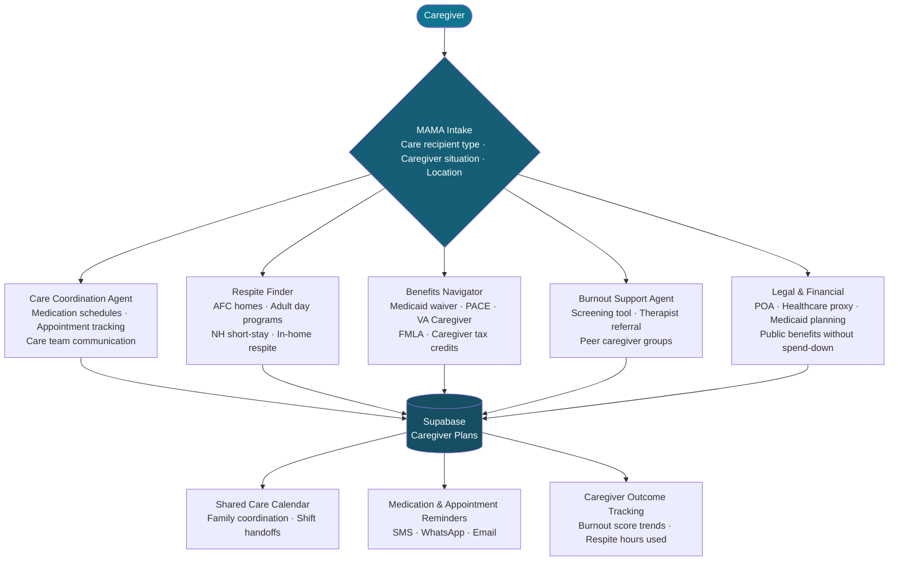

<p align="center">
  <h1 align="center">foundation-caregiver-ally</h1>
  <h3 align="center"><em>53 million unpaid caregivers. 60% burnout. Care coordination, respite finder, and support — finally in one place.</em></h3>
</p>

<p align="center">
  <a href="LICENSE"></a>
  
  
  <a href="https://mama.oliwoods.ai"></a>
  <a href="https://mama.oliwoods.ai/foundation"></a>
</p>

---

> *"53 million Americans — 1 in 5 — provide unpaid care to an adult or child with special needs. The economic value of their labor is $470 billion per year. The support system for those caregivers is nearly invisible."*
> — **AARP / National Alliance for Caregiving, 2020** | 60% of caregivers report clinically significant burnout. Nearly half reduce their own healthcare to keep up with caregiving demands.

---

## Why This Exists

Caregiving is one of the largest and least-supported workforces in America. Most caregivers stumble through a fragmented system of programs, eligibility rules, and waitlists — while simultaneously managing their own emotional and physical collapse.

- **53 million Americans** provide unpaid care — an estimated $470 billion in annual economic value — AARP/NAC 2020
- **60% of caregivers** meet the clinical threshold for burnout; 40% report depression — AARP 2020
- **47% of caregivers** delay their own medical care due to caregiver responsibilities — AARP 2022
- The average caregiver provides **24.4 hours of unpaid care per week** — while 60% also hold a paying job — NAC/AARP 2020
- **1 in 5 caregivers** are unaware of federal and state programs available to support them, including paid family leave and caregiver tax credits — NAC 2022

**We built this because the people keeping families together are falling apart — and no one built a system for them.**

---

## System Architecture



---

## Features

| Agent | What It Does | Data Sources |
|---|---|---|
| **Care Coordination** | Centralized medication schedule, appointment tracker, and care team messaging | User-managed + EHR integrations |
| **Respite Finder** | Maps adult day programs, AFC homes, in-home respite services, and short-stay facilities by zip | ARCH National Respite Network, Eldercare Locator |
| **Benefits Navigator** | Screens for Medicaid HCBS waivers, PACE, VA Caregiver Support, FMLA, state caregiver tax credits | HHS, VA, state Medicaid portals, CBPP |
| **Burnout Support** | Validated Zarit Burden Interview screening, therapist referral, peer caregiver support group matching | AARP, Family Caregiver Alliance |
| **Legal & Financial** | POA/healthcare proxy templates, Medicaid planning guidance, spend-down avoidance | NCLER, state legal aid, ElderLaw attorneys |
| **Shared Care Calendar** | Multi-family member coordination, shift scheduling, handoff notes | In-app, iCal/Google Calendar sync |

### Platform Capabilities
- **Shared Access** — multiple family members can collaborate on the same care plan
- **Daily Check-ins** — burnout score tracking over time with early warning alerts
- **SMS/WhatsApp Reminders** — medication and appointment alerts for care recipients
- **Offline-First** — care calendar and medication list accessible without internet
- **Privacy-First** — healthcare and financial data never sold; HIPAA-aware

---

## Quick Start

```bash
git clone https://github.com/OliWoods-Org/foundation-caregiver-ally.git
cd foundation-caregiver-ally
npm install
npm run dev
```

## Tech Stack

- **Runtime:** Node.js + TypeScript
- **Validation:** Zod schemas
- **Database:** Supabase (PostgreSQL)
- **AI:** Claude API / local LLM (care coordination, burnout screening analysis)
- **Alerts:** Twilio (SMS/WhatsApp), Resend (email)
- **Calendar:** Google Calendar API, iCal export
- **Data:** ARCH National Respite Network, Eldercare Locator, AARP caregiving resources

---

## Research & Citations

- AARP and National Alliance for Caregiving. (2020). *Caregiving in the U.S. 2020*. aarp.org/research/topics/care/info-2020/caregiving-in-the-united-states.html
- AARP Public Policy Institute. (2022). *Valuing the Invaluable: 2023 Update*.
- National Alliance for Caregiving. (2022). *Caregiving in America: A National Profile*.
- Zarit, S.H. et al. (1980). Relatives of the impaired elderly: correlates of feelings of burden. *The Gerontologist*, 20(6), 649–655. (Zarit Burden Interview)
- Family Caregiver Alliance. (2023). *Caregiver Statistics: Health, Technology, and Caregiving Resources*. caregiver.org

---

## Contributing

We welcome contributions. This is open source because we believe in community-driven solutions.

1. Fork the repo
2. Create a feature branch (`git checkout -b feat/your-feature`)
3. Commit your changes
4. Push and open a PR

## License

AGPL-3.0 — Free to use, modify, and distribute.

---

<p align="center">
  <strong>Built by the <a href="https://oliwoods.ai">OliWoods Foundation</a></strong><br>
  <em>Free forever. Open source. Because caregivers deserve care too.</em>
</p>
